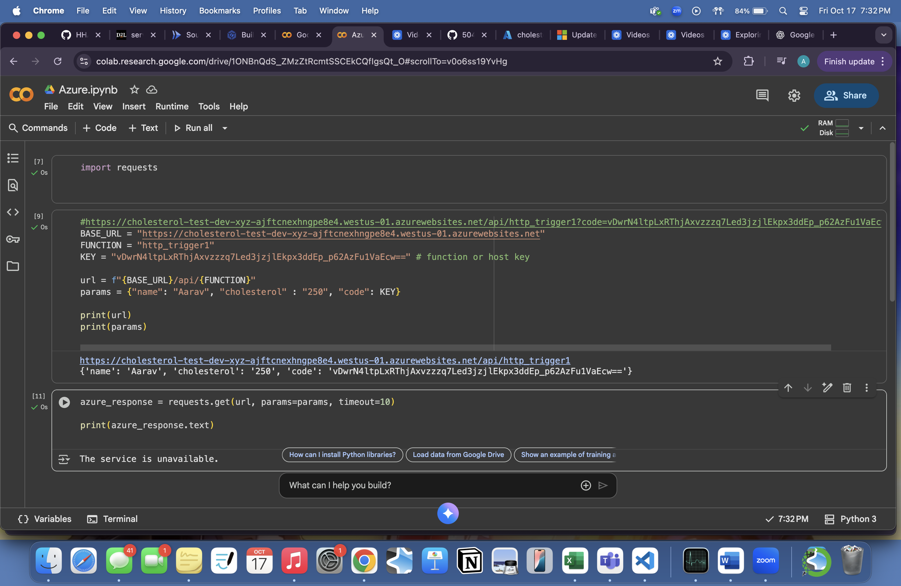

# Assignment 3: Serverless
## Lab Rules - Cholesterol
### For a cholesterol test, there are 3 ranges that equal different readings. If the cholesterol level is in the range of 200 to 239, that means someone is "At Risk". If it the range is greater than 340 than that means that someone crossed the threshold into the "Dangerous Territory". If the range is less than 200 than that means that someone is "Heart Healthy"

### The rule I implemented is that if the range is from 200 - 239 then somone is "At Risk". If the range is less than 200 then somone is "Heart Healthy". If the range is less than 200 then someone is "Heart Healthy"

## Cloud Environment
### Google Cloud with the region in europe-west1
### Azure with the reigon in west US

## Azure Photos

### The deployment does not allow me to create a function

### My code to pull the url works but the service is unavaliable

## Google Photos

### This deployment works. My code and everything works

###  This image shows that when I input a number for cholestrol, I get an output. In this example, I put the value as 250 and I got the output **Dangerous**

## Link to Article by Cleveland Clinic
### [Cholesterol Article](https://my.clevelandclinic.org/health/articles/11920-cholesterol-numbers-what-do-they-mean)

## Publicly Accessible Endpoint URL
[Google Cloud](https://blood-pressure-280336111434.europe-west1.run.app)

[Azure](https://cholesterol-test-dev-xyz-ajftcnexhngpe8e4.westus-01.azurewebsites.net)

### Loom
[Google Cloud](https://www.loom.com/share/4b88eb837f214188a3150a244c9059d4?sid=5e67f3a4-a32f-4657-bc30-169abf8b3728)

[Azure](https://www.loom.com/share/67fb20ce28944d43920b42c1287cc9d8?sid=0c9cad6d-c05d-4462-bb20-e9ebef002c33)

## Which one is better
### I personally think Google Cloud and Cloud Run is better. Google Cloud is easier to use and deploy. It has sleek and minimal configurtion compared to Azure with which you have to set up storage and binding and function apps and resource groups. Another good thing about Cloud Run is how it allows you to deploy any container and it scales to 0 when idle. Google Cloud Run is also much cheaper compared to Microsoft Azure's function apps. The pricing and reason why is more transparent for Google Cloud Run, for Function Apps, they hide additional costs behind other functions like storage accounts etc. In terms of speed, reliability, and even pricing, Google Cloud Run is much better than Azure Function Apps. 